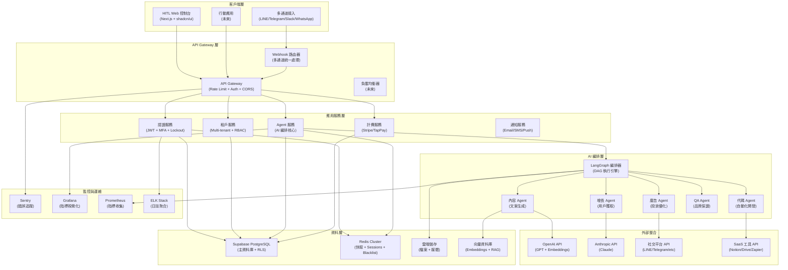
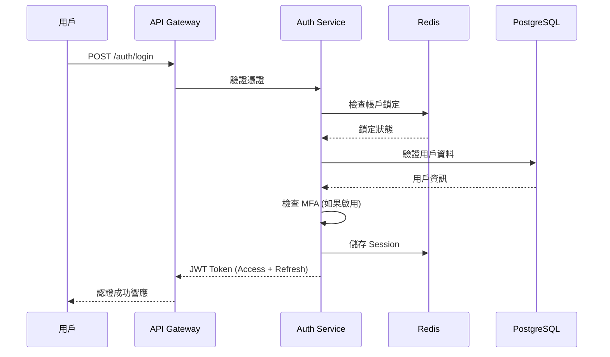
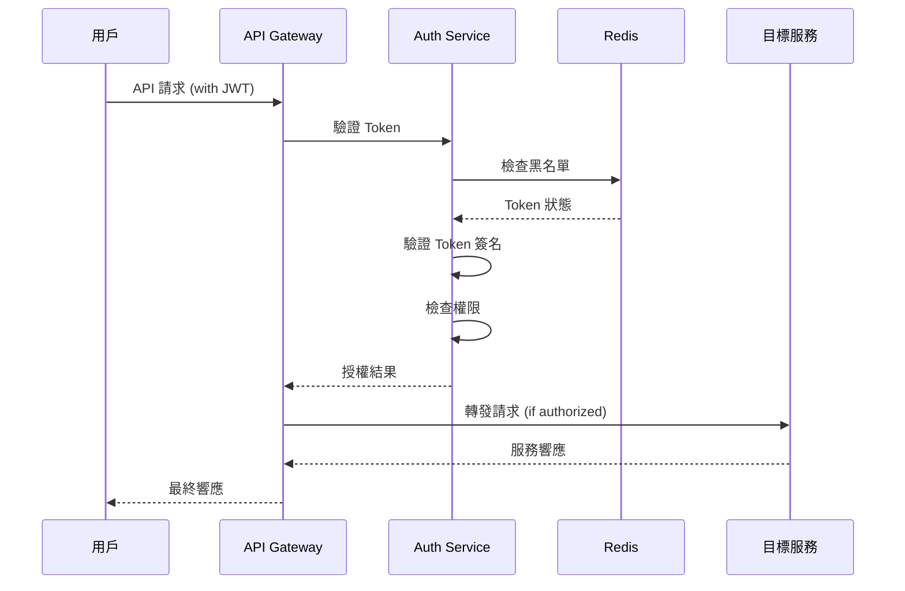
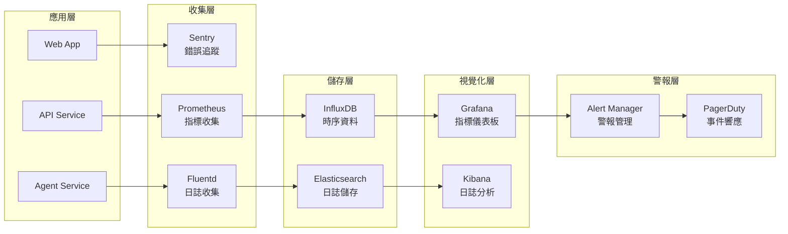

# MorningAI MVP 技術架構文檔

## 📐 架構概覽

本文檔詳細描述 MorningAI MVP 的技術架構設計，包括系統組件、資料流、安全設計和擴展性考量。

---

## 🏗️ 高層架構圖



---

## 🔧 核心組件詳解

### 1. API Gateway 層

#### API Gateway
- **功能**: 統一 API 入口點
- **技術**: Flask + Gunicorn
- **責任**:
  - 請求路由和負載均衡
  - 認證和授權檢查
  - 速率限制和 DDoS 防護
  - CORS 政策執行
  - 請求/響應日誌記錄

#### Webhook 路由器
- **功能**: 多通道 Webhook 統一處理
- **技術**: Flask Blueprint
- **責任**:
  - 不同平台 Webhook 格式標準化
  - 訊息路由到對應 Agent
  - 重試機制和錯誤處理
  - 事件去重和冪等性保證

### 2. 應用服務層

#### 認證服務 (AuthService)
```python
# 核心功能
class AuthService:
    def authenticate(self, credentials) -> JWT
    def authorize(self, token, resource) -> bool
    def enable_mfa(self, user_id) -> MFASecret
    def lockout_account(self, user_id, reason) -> None
    def blacklist_token(self, jti) -> None
```

**安全機制**:
- JWT 存取令牌 + 刷新令牌
- Redis 基礎的 JWT 黑名單
- TOTP 基礎的多因素驗證
- 帳戶鎖定和解鎖機制
- 密碼強度和歷史檢查

#### 租戶服務 (TenantService)
```python
# 多租戶管理
class TenantService:
    def create_tenant(self, tenant_data) -> Tenant
    def get_tenant_context(self, user_id) -> TenantContext
    def check_permissions(self, user, action, resource) -> bool
    def manage_subscription(self, tenant_id, plan) -> Subscription
```

**隔離機制**:
- 基於 `tenant_id` 的資料隔離
- RLS 政策自動執行
- 租戶級別的配置管理
- 資源使用量追蹤和限制

#### Agent 服務 (AgentService)
```python
# AI Agent 管理
class AgentService:
    def create_task(self, task_spec) -> Task
    def execute_dag(self, dag_definition) -> Execution
    def monitor_progress(self, execution_id) -> Status
    def handle_hitl_intervention(self, task_id, decision) -> None
```

### 3. AI 編排層

#### LangGraph 編排器
```python
# DAG 執行引擎
class Orchestrator:
    def parse_dag(self, dag_json) -> DAG
    def execute_node(self, node, context) -> Result
    def handle_conditional_flow(self, condition, context) -> NextNode
    def manage_parallel_execution(self, nodes) -> Results
    def trigger_hitl_checkpoint(self, context) -> Decision
```

**編排特性**:
- JSON 基礎的 DAG 定義
- 條件分支和並行執行
- HITL 檢查點和人工介入
- 錯誤處理和重試機制
- 執行狀態持久化

#### 專業 Agent 設計

##### Content Agent
```python
class ContentAgent:
    def generate_article(self, topic, style) -> Article
    def create_social_post(self, content, platform) -> Post
    def optimize_seo(self, content) -> OptimizedContent
    def translate_content(self, text, target_lang) -> Translation
```

##### Growth Agent
```python
class GrowthAgent:
    def analyze_user_behavior(self, data) -> Insights
    def recommend_strategies(self, metrics) -> Strategies
    def optimize_funnel(self, conversion_data) -> Optimizations
    def predict_churn(self, user_data) -> ChurnRisk
```

---

## 💾 資料架構

### 資料庫設計 (PostgreSQL + RLS)

#### 核心表結構
```sql
-- 租戶表
CREATE TABLE tenants (
    id UUID PRIMARY KEY DEFAULT gen_random_uuid(),
    name TEXT NOT NULL,
    plan TEXT NOT NULL DEFAULT 'free',
    created_at TIMESTAMPTZ DEFAULT NOW(),
    updated_at TIMESTAMPTZ DEFAULT NOW()
);

-- 用戶表
CREATE TABLE users (
    id UUID PRIMARY KEY DEFAULT gen_random_uuid(),
    tenant_id UUID REFERENCES tenants(id),
    email TEXT UNIQUE NOT NULL,
    password_hash TEXT NOT NULL,
    role TEXT NOT NULL DEFAULT 'user',
    mfa_enabled BOOLEAN DEFAULT FALSE,
    mfa_secret TEXT,
    locked_until TIMESTAMPTZ,
    created_at TIMESTAMPTZ DEFAULT NOW()
);

-- Agent 任務表
CREATE TABLE agent_tasks (
    id UUID PRIMARY KEY DEFAULT gen_random_uuid(),
    tenant_id UUID REFERENCES tenants(id),
    user_id UUID REFERENCES users(id),
    agent_type TEXT NOT NULL,
    dag_definition JSONB NOT NULL,
    status TEXT NOT NULL DEFAULT 'pending',
    result JSONB,
    created_at TIMESTAMPTZ DEFAULT NOW()
);

-- HITL 決策表
CREATE TABLE hitl_decisions (
    id UUID PRIMARY KEY DEFAULT gen_random_uuid(),
    task_id UUID REFERENCES agent_tasks(id),
    checkpoint_name TEXT NOT NULL,
    decision JSONB NOT NULL,
    decided_by UUID REFERENCES users(id),
    decided_at TIMESTAMPTZ DEFAULT NOW()
);
```

#### RLS 政策範例
```sql
-- 租戶隔離政策
CREATE POLICY "tenant_isolation" ON agent_tasks
FOR ALL USING (tenant_id = auth.jwt() ->> 'tenant_id');

-- 用戶資料存取政策
CREATE POLICY "user_own_data" ON users
FOR SELECT USING (
    id = auth.uid() OR 
    (auth.jwt() ->> 'role' = 'admin' AND tenant_id = auth.jwt() ->> 'tenant_id')
);

-- HITL 決策權限政策
CREATE POLICY "hitl_decision_access" ON hitl_decisions
FOR ALL USING (
    decided_by = auth.uid() OR
    EXISTS (
        SELECT 1 FROM agent_tasks 
        WHERE id = task_id AND tenant_id = auth.jwt() ->> 'tenant_id'
    )
);
```

### Redis 資料結構

#### JWT 黑名單
```redis
# 格式: jwt:blacklist:<jti>
# TTL: JWT 過期時間
SET jwt:blacklist:abc123 "revoked" EX 86400
```

#### 用戶 Sessions
```redis
# 格式: session:<user_id>
# 內容: 序列化的 session 資料
HSET session:user123 
    tenant_id "tenant456"
    role "admin"
    last_activity "2025-09-20T10:00:00Z"
```

#### 速率限制
```redis
# 格式: rate_limit:<endpoint>:<user_id>
# 內容: 請求計數
INCR rate_limit:api_call:user123
EXPIRE rate_limit:api_call:user123 3600
```

#### 帳戶鎖定
```redis
# 格式: lockout:<user_id>
# 內容: 失敗嘗試次數
INCR lockout:user123
EXPIRE lockout:user123 1800
```

---

## 🔒 安全架構

### 認證流程


### 授權檢查


### 多層防護機制

#### 1. 網路層
- **HTTPS 強制**: 全站 SSL/TLS 加密
- **CORS 政策**: 嚴格的跨域控制
- **DDoS 防護**: Cloudflare 或 AWS Shield

#### 2. 應用層
- **輸入驗證**: 所有用戶輸入嚴格驗證
- **SQL 注入防護**: 參數化查詢和 ORM
- **XSS 防護**: 內容安全政策 (CSP)

#### 3. 資料層
- **加密儲存**: 敏感資料 AES-256 加密
- **備份加密**: 資料庫備份加密儲存
- **存取日誌**: 所有資料存取記錄

---

## 📊 監控和可觀測性

### 監控架構


### 關鍵指標 (KPIs)

#### 技術指標
- **可用性**: 99.9% uptime 目標
- **響應時間**: P95 < 500ms
- **錯誤率**: < 0.1%
- **吞吐量**: 1000 RPS 目標

#### 業務指標
- **用戶活躍度**: DAU/MAU
- **轉換率**: Free → Paid
- **Agent 成功率**: 任務完成率
- **收入指標**: MRR/ARR

### 警報規則
```yaml
# Prometheus 警報規則範例
groups:
  - name: api_alerts
    rules:
      - alert: HighErrorRate
        expr: rate(http_requests_total{status=~"5.."}[5m]) > 0.01
        for: 5m
        labels:
          severity: critical
        annotations:
          summary: "High error rate detected"

      - alert: HighResponseTime
        expr: histogram_quantile(0.95, rate(http_request_duration_seconds_bucket[5m])) > 0.5
        for: 10m
        labels:
          severity: warning
        annotations:
          summary: "High response time detected"
```

---

## 🚀 擴展性設計

### 水平擴展策略

#### 應用層擴展
- **無狀態設計**: 所有服務無狀態，支援水平擴展
- **負載均衡**: Nginx/HAProxy 負載均衡
- **容器化**: Docker + Kubernetes 編排

#### 資料層擴展
- **讀寫分離**: PostgreSQL 主從複製
- **分片策略**: 基於 tenant_id 的資料分片
- **快取層**: Redis Cluster 分散式快取

#### AI 服務擴展
- **Agent 池**: 動態 Agent 實例管理
- **任務佇列**: Celery + Redis 非同步處理
- **GPU 資源**: 按需 GPU 實例調度

### 效能優化

#### 前端優化
- **代碼分割**: React.lazy + Suspense
- **CDN 加速**: 靜態資源 CDN 分發
- **快取策略**: Service Worker + 瀏覽器快取

#### 後端優化
- **資料庫優化**: 索引優化 + 查詢優化
- **API 快取**: Redis 快取熱點資料
- **連接池**: 資料庫連接池管理

#### AI 服務優化
- **模型快取**: 預載入常用模型
- **批次處理**: 批次 API 呼叫優化
- **結果快取**: 相似任務結果快取

---

## 🔄 災難恢復

### 備份策略
- **資料庫備份**: 每日全量 + 每小時增量
- **檔案備份**: S3 跨區域複製
- **配置備份**: Infrastructure as Code

### 故障轉移
- **資料庫故障轉移**: 自動主從切換
- **服務故障轉移**: Kubernetes 自動重啟
- **區域故障轉移**: 多區域部署 (Phase 3)

### 恢復程序
1. **檢測故障**: 自動監控和警報
2. **評估影響**: 故障範圍和影響評估
3. **執行恢復**: 自動或手動恢復程序
4. **驗證恢復**: 服務功能驗證
5. **事後分析**: 根本原因分析和改進

---

**文檔維護者**: Manus AI  
**最後更新**: 2025-09-20  
**版本**: v1.0
