# MorningAI MVP 專案全面概覽

## 📋 文檔目的

本文檔為新加入的開發者提供 MorningAI MVP 專案的完整理解，包括業務願景、技術架構、開發流程和當前進度。

**最後更新**: 2025-09-20  
**文檔版本**: v1.0  
**適用對象**: 新加入的開發者、技術主管、產品經理

---

## 🎯 專案核心願景

### 業務定位
MorningAI MVP 是一個**企業級 AI SaaS 多租戶平台**，提供 AI Agent 編排和自動化服務。

### 核心價值主張
- **AI Agent 編排**: 通過 LangGraph DAG 實現複雜的 AI 工作流程
- **HITL (Human-in-the-Loop)**: 人工介入的智能決策控制台
- **多通道整合**: 支援 LINE、Telegram、Slack、WhatsApp、WeChat
- **企業級安全**: 符合 GDPR、SOC2、ISO27001 標準

### 目標市場
- **企業客戶**: 需要 AI 自動化的中大型企業
- **個人用戶**: 需要智能助手的專業人士
- **開發者**: 需要 AI 編排能力的技術團隊

### 商業模式
```
Free Tier → Pro Plan → Enterprise Plan
基於租戶數量、Agent 類型、編排規模、SLA 等級定價
```

---

## 🏗️ 技術架構

### 四層架構設計

```mermaid
flowchart LR
  subgraph Client["客戶端層"]
    WebConsole["HITL Web 控制台"]
    Channels["多通道接入"]
  end

  subgraph Gateway["Gateway 層"]
    APIGW["API Gateway"]
    WebhookOrch["Webhook 編排器"]
  end

  subgraph Adapter["Adapter 層"]
    MsgAdapters["訊息適配器"]
    SaaSAdapters["SaaS 適配器"]
  end

  subgraph AIEngine["AI 引擎層"]
    Orchestrator["LangGraph 編排器"]
    Agents["專業 Agent"]
  end

  subgraph Data["資料層"]
    Supabase["Supabase (PostgreSQL + RLS)"]
    Redis["Redis (Sessions/Blacklist)"]
    Storage["雲端儲存"]
  end

  Client --> Gateway
  Gateway --> Adapter
  Adapter --> AIEngine
  AIEngine --> Data
```



### 核心技術棧

#### 前端技術
- **框架**: Next.js/React + TypeScript
- **UI 庫**: Tailwind CSS + shadcn/ui + Tremor
- **狀態管理**: React Hooks + Context
- **部署**: Vercel
- **構建工具**: Vite

#### 後端技術
- **框架**: Python Flask + Flask-RESTX
- **資料庫**: Supabase (PostgreSQL)
- **快取**: Redis
- **認證**: JWT + Supabase Auth
- **部署**: Render (Docker)

#### AI 編排技術
- **編排引擎**: LangGraph
- **任務規範**: JSON DAG 定義
- **Agent 類型**: Content、Growth、Ad Buyer、CodeWriter、AutoQA

#### 基礎設施
- **CI/CD**: GitHub Actions
- **監控**: Sentry + Grafana + Prometheus
- **日誌**: 結構化日誌 + ELK Stack
- **安全**: RLS + JWT Blacklist + Rate Limiting

---

## 📊 專案結構

### Monorepo 架構
```
morningai-mvp/
├── apps/
│   ├── web/          # 前端應用 (Next.js)
│   └── api/          # 後端 API (Flask)
├── infra/            # 基礎設施配置
│   ├── render/       # Render 部署配置
│   ├── vercel/       # Vercel 部署配置
│   └── supabase/     # Supabase 配置
├── .github/          # CI/CD 工作流程
│   └── workflows/    # GitHub Actions
├── docs/             # 專案文檔
├── scripts/          # 自動化腳本
├── supabase/         # 資料庫遷移和 RLS 政策
└── ops/              # 運維腳本和環境配置
```

### 關鍵目錄說明

#### `apps/web` - 前端應用
- **技術**: React + TypeScript + Tailwind CSS
- **主要功能**: HITL 控制台、租戶管理、Agent 配置
- **部署**: Vercel (https://morningai-mvp-web.vercel.app)

#### `apps/api` - 後端 API
- **技術**: Flask + SQLAlchemy + Alembic
- **主要功能**: 認證、多租戶、Agent 編排、Webhook 處理
- **部署**: Render (https://morningai-mvp.onrender.com)

#### `supabase/` - 資料庫層
- **遷移檔案**: SQL 遷移腳本
- **RLS 政策**: 行級安全政策定義
- **測試腳本**: 資料庫功能測試

---

## 🔒 安全架構

### 多層安全設計

#### 1. 認證與授權
- **JWT Token**: 存取令牌 + 刷新令牌機制
- **JWT 黑名單**: Redis 基礎的令牌撤銷
- **多因素驗證**: TOTP 基礎的 2FA
- **帳戶鎖定**: 防暴力破解機制

#### 2. 資料安全
- **Row Level Security (RLS)**: Supabase 行級安全
- **租戶隔離**: 基於 `tenant_id` 的資料隔離
- **加密儲存**: 敏感資料加密
- **審計日誌**: 完整的操作追蹤

#### 3. 網路安全
- **API Gateway**: 統一的 API 入口點
- **速率限制**: 防 DDoS 和濫用
- **CORS 政策**: 嚴格的跨域控制
- **HTTPS 強制**: 全站 SSL/TLS 加密

#### 4. 合規準備
- **GDPR**: 資料保護和隱私權
- **SOC2**: 安全控制框架
- **ISO27001**: 資訊安全管理系統

### RLS 政策範例
```sql
-- 用戶只能存取自己的資料
CREATE POLICY "users_own_data" ON users
FOR ALL USING (auth.uid() = id);

-- 租戶隔離政策
CREATE POLICY "tenant_isolation" ON projects
FOR ALL USING (tenant_id = auth.jwt() ->> 'tenant_id');

-- 管理員可存取所有資料
CREATE POLICY "admin_access" ON users
FOR ALL USING (
  auth.jwt() ->> 'role' = 'admin'
);
```

---

## 🚀 分階段路線圖

### Phase 0 - 基礎建設 ✅ (已完成 90%)

**目標**: 建立穩固的技術基礎

**已完成**:
- ✅ Monorepo 架構設置
- ✅ CI/CD 管道 (GitHub Actions)
- ✅ 認證系統 (JWT + Supabase)
- ✅ RLS 政策實施
- ✅ JWT 黑名單機制
- ✅ 帳戶鎖定功能
- ✅ UI 系統 (Tailwind + shadcn/ui)
- ✅ 代碼品質工具鏈

**待完成**:
- 🔄 統一套件管理器 (npm)
- 🔄 API 文檔完善

### Phase 1 - MVP 上線 🔄 (進行中)

**目標**: 可用的 SaaS MVP

**進行中**:
- 🔄 多租戶註冊系統
- 🔄 推薦裂變機制
- 🔄 HITL 控制台開發
- 🔄 金流整合 (Stripe/TapPay)
- 🔄 監控與日誌系統

**預期交付**:
- 完整的用戶註冊流程
- 基礎的租戶管理功能
- 簡單的 Agent 配置介面
- 支付和訂閱系統

### Phase 2 - AI 編排層 📋 (規劃中)

**目標**: 核心 AI 編排能力

**計劃功能**:
- DAG 編排器開發
- JSON 任務規範定義
- 核心 Agent 實現:
  - Growth Agent (增長優化)
  - Content Agent (內容生成)
  - Ad Buyer Agent (廣告投放)
- Webhook → Agent → HITL 循環
- i18n 多語系支援

### Phase 3 - 業務擴展層 🔮 (未來)

**目標**: 企業級功能和合規

**計劃功能**:
- Agent 市集
- 外部 SaaS 整合
- 完整合規實施 (GDPR/ISO27001)
- 多區域部署
- 高級分析和報告

---

## 🔧 開發流程

### CI/CD 管道

#### 觸發條件
- **Pull Request**: 自動執行完整檢查
- **Push to main**: 自動部署到生產環境
- **定時任務**: 定期健康檢查和安全掃描

#### 檢查項目
1. **環境變數檢查**: 驗證配置完整性
2. **程式碼風格檢查**: ESLint + Flake8
3. **類型檢查**: TypeScript + MyPy
4. **單元測試**: Jest + Pytest
5. **整合測試**: API 端點測試
6. **安全掃描**: Bandit + npm audit
7. **導入煙霧測試**: 驗證模組導入
8. **健康檢查**: 線上服務狀態驗證

#### 自動化功能
- **PR 評論**: 自動生成測試結果摘要
- **Artifacts 生成**: 測試報告和日誌收集
- **部署通知**: Slack/Discord 通知
- **回滾機制**: 自動故障檢測和回滾

### 代碼品質標準

#### Python (後端)
```bash
# 格式化
black apps/api/src/
isort apps/api/src/

# 檢查
flake8 apps/api/src/
bandit -r apps/api/src/
mypy apps/api/src/

# 測試
pytest apps/api/tests/ --cov=src
```

#### TypeScript (前端)
```bash
# 格式化
prettier --write apps/web/src/

# 檢查
eslint apps/web/src/
tsc --noEmit

# 測試
npm test -- --coverage
```

### Pre-commit Hooks
```yaml
repos:
  - repo: https://github.com/psf/black
    hooks:
      - id: black
  - repo: https://github.com/pycqa/isort
    hooks:
      - id: isort
  - repo: https://github.com/pycqa/flake8
    hooks:
      - id: flake8
  - repo: https://github.com/pre-commit/mirrors-prettier
    hooks:
      - id: prettier
```

---

## 🌐 部署架構

### 生產環境

#### 前端部署 (Vercel)
- **URL**: https://morningai-mvp-web.vercel.app
- **框架**: Next.js (Vite)
- **自動部署**: Git push 觸發
- **環境變數**: Supabase 公開金鑰、API 端點

#### 後端部署 (Render)
- **URL**: https://morningai-mvp.onrender.com
- **容器**: Docker (Python Flask)
- **健康檢查**: `/health` 端點
- **自動部署**: Git push 觸發
- **環境變數**: 資料庫、Redis、SMTP 配置

#### 資料庫 (Supabase)
- **類型**: PostgreSQL with RLS
- **備份**: 自動每日備份
- **監控**: 內建監控和警報
- **擴展**: 自動擴展支援

#### 快取 (Redis)
- **用途**: Sessions、JWT 黑名單、速率限制
- **高可用**: 計劃實施 Redis 叢集
- **持久化**: RDB + AOF 雙重持久化

### 監控和可觀測性

#### 應用監控
- **錯誤追蹤**: Sentry
- **性能監控**: Render 內建 + 計劃 New Relic
- **正常運行時間**: UptimeRobot
- **日誌聚合**: 計劃 ELK Stack

#### 業務指標
- **用戶活躍度**: DAU/MAU
- **轉換率**: Free → Paid
- **Agent 成功率**: 任務完成率
- **系統性能**: 響應時間、錯誤率

---

## 📚 關鍵文檔

### 技術文檔
- [`docs/RLS_POLICIES.md`](./RLS_POLICIES.md) - 資料庫安全政策
- [`docs/CODE_QUALITY.md`](./CODE_QUALITY.md) - 代碼品質指南
- [`scripts/code-quality.sh`](../scripts/code-quality.sh) - 品質檢查腳本
- [`DEPLOYMENT_ACCEPTANCE_REPORT.md`](../DEPLOYMENT_ACCEPTANCE_REPORT.md) - 部署驗收報告

### API 文檔
- **Swagger UI**: https://morningai-mvp.onrender.com/docs
- **健康檢查**: https://morningai-mvp.onrender.com/health
- **API 規格**: OpenAPI 3.0 格式

### 運維文檔
- **環境變數**: `.env.example` 檔案
- **部署指南**: `infra/` 目錄下的 README
- **故障排除**: 計劃建立 Runbook

---

## 🎯 當前狀態和下一步

### 當前進度 (Phase 0 → Phase 1)
- **整體完成度**: 約 75%
- **技術基礎**: 90% 完成
- **業務功能**: 40% 完成
- **部署狀態**: 生產環境穩定運行

### 立即優先級 (本週)
1. **完成 API 文檔**: Swagger/OpenAPI 完善
2. **多租戶註冊**: 完整的用戶註冊流程
3. **HITL 控制台**: 基礎儀表板功能
4. **監控增強**: Sentry 整合和警報設置

### 短期目標 (本月)
1. **金流整合**: Stripe/TapPay 支付系統
2. **推薦系統**: 用戶推薦裂變機制
3. **性能優化**: 前端代碼分割和 CDN
4. **安全增強**: MFA 和速率限制

### 中期目標 (下季度)
1. **AI 編排層**: LangGraph DAG 實現
2. **核心 Agent**: Growth/Content/Ad Buyer
3. **高可用性**: Redis 叢集和 DB 故障轉移
4. **合規準備**: GDPR 和 SOC2 初步實施

---

## 🤝 團隊協作

### 開發流程
1. **功能開發**: Feature branch → PR → Code Review → Merge
2. **Bug 修復**: Hotfix branch → 快速 PR → 緊急部署
3. **發布管理**: Release branch → 完整測試 → 標籤發布

### 溝通渠道
- **技術討論**: GitHub Issues 和 Discussions
- **日常溝通**: Slack/Discord
- **文檔協作**: Notion + GitHub Wiki
- **代碼審查**: GitHub PR Review

### 責任分工
- **前端開發**: React/TypeScript 專家
- **後端開發**: Python/Flask 專家
- **DevOps**: CI/CD 和部署專家
- **AI 工程**: LangGraph 和 Agent 開發
- **產品**: 業務邏輯和用戶體驗

---

## 📞 支援和資源

### 快速開始
1. **Clone 專案**: `git clone https://github.com/RC918/morningai-mvp.git`
2. **環境設置**: 複製 `.env.example` 並填入配置
3. **安裝依賴**: `npm install` (根目錄) + `pip install -r requirements.txt` (API)
4. **本地開發**: `npm run dev` (前端) + `python src/main.py` (後端)

### 常用命令
```bash
# 代碼品質檢查
./scripts/code-quality.sh

# 運行測試
npm test                    # 前端測試
pytest apps/api/tests/     # 後端測試

# 本地部署
docker-compose up          # 完整本地環境
```

### 故障排除
- **部署問題**: 檢查 Render/Vercel 日誌
- **資料庫問題**: 檢查 Supabase 控制台
- **CI/CD 問題**: 檢查 GitHub Actions 日誌
- **本地開發**: 檢查環境變數和依賴安裝

### 聯絡方式
- **技術問題**: 提交 GitHub Issue
- **緊急問題**: Slack 直接聯絡
- **文檔問題**: 提交 PR 修正
- **業務問題**: 產品團隊討論

---

**文檔維護者**: Manus AI  
**最後更新**: 2025-09-20  
**下次審查**: 2025-10-01
